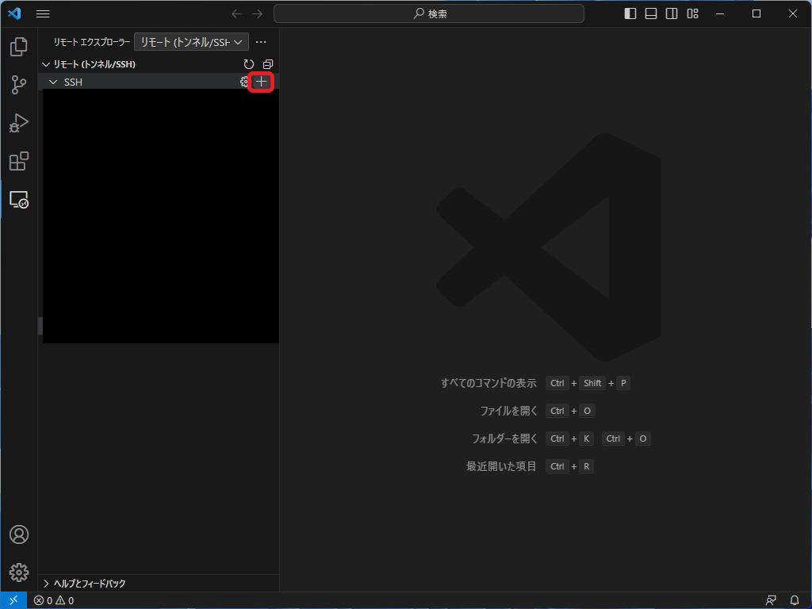

# cps学習用 ハードウェア

以下に実世界で動かす場合の方法を記載する．

手順は次の通りである．

1. ハードウェアの準備
1. Raspbeery pi用のソフトウェアの構築

## ハードウェア準備
- 必要な物品
    - [Dynamixel contorller](https://www.besttechnology.co.jp/modules/onlineshop/index.php?fct=photo&p=291)
        - これは代替品でも構わない
    - Dynamixel 電源供給基盤部品
        - ユニバーサル基盤
        - [JSTコネクタ](https://e-shop.robotis.co.jp/product.php?id=373)
            -購入先は一例
        - 電源用コネクタ
            - XT60を推奨
        - 配線
    - Sensor接続用基盤部品
        - [2 x 20 pin コネクタ](https://jp.misumi-ec.com/vona2/detail/222000486813/?HissuCode=PS-40SD-D4C2)
        - [コネクタ用コンタクト](https://jp.misumi-ec.com/vona2/detail/222000484057/?HissuCode=030-51307-001)
        - [レベルコンバータIC](https://ssci.to/2375)
        - 配線
- 組み立て
    - Dynamixel 電源供給基盤部品
        - JSTコネクタ1番ピンをGND,2番ピンに電源を供給するようにする．
    - Sensor接続用基盤部品
        - 以下通りに配線を行う．
            | 2x20 pin コネクタ| レベルコンバータIC | Grove Connector|
            | ---- | ---- | ---- |
            | pin 1 (3.3V) | pin 1 (VCC A) | - |
            | pin 5 (SDL) | pin 3 (SCLA) | - |
            | pin 3 (SDA) | pin 2 (SDAA) | - |
            | pin 2 (5V) | pin 8 (VCCB) | pin 3 (VCC) |
            | - | pin 7 (SDLB) | pin 1 (SDL) |
            | - | pin 6 (SDAB) | pin 2 (SDA) |
            | pin 6 (GND) | pin 4 (GND) | pin 4 (GND)|
            |-|pin 5 (EN)|-|


## Raspbeery pi 構築
1. OSイメージをmicro sdへコピーする．
    - [この](https://ascii.jp/elem/000/004/094/4094421/)ページを参考にUbuntu 22.04.2 (64bit)をインストールする．
1. micro sdをraspbery piへ挿入し，起動する．
    - 起動した後初回セットアップでユーザー名やパスワードの設定を求められるので適切に入力する．
    - 自動的に再起動となり，そのあとログインを行う．
1. ターミナルを立ち上げ，以下操作を行う．
    1. 必要ソフトウェアをインストールする．
        ```
        apt update
        apt install -y git curl ssh
        ```
    1. dockerのインストールする．
        ```
        curl https://get.docker.com | sh
        sudo usermod -aG docker ${USER}
        ```
    1. 一度再起動し，再度ログインする．
    1. 本リポジトリをクローンする．
        ```
        cd ~
        git clone --recursive https://github.com/IRSL-tut/cps_rpi_docker.git
        ```
    1. docker imageのビルドする．(注意:2~3時間程度かかる)
        ```
        cd ~/cps_rpi_docker/docker 
        ./build.sh
        ```
    1. ソースのビルドをする．
        ```
        cd ~/cps_rpi_docker/docker 
        ./source_build.sh
        ```
    1. デバイスの初期設定値を変更する．
        ```
        cd ~/cps_rpi_docker
        sudo cp udev/99-udev.rules /etc/udev/rules.d/. 
        sudo udevadm control --reload-rules
        sudo udevadm trigger
        ```

## 使用方法
### センサ用configの設定
userdir 内にあるrobot_sensor.jsonを使用するセンサに合わせて書き換える．(詳細は[ここ](https://github.com/IRSL-tut/sensor_pi/blob/main/README.md)を参照のこと)
- (例1) TOFセンサ1つの場合
    ```
    {
        "I2CHubPublisher": {
            "0": {
                "name": "TOFPublisher",
                "address": "0x29",
                "topic_name": "TOFSensor/value"
            },
            "address": "0x70"
        }
    }
    ```
- (例2) TOFセンサ2つの場合
    ```
    {
        "I2CHubPublisher": {
            "0": {
                "name": "TOFPublisher",
                "address": "0x29",
                "topic_name": "TOFSensor1/value"
            },
            "1": {
                "name": "TOFPublisher",
                "address": "0x29",
                "topic_name": "TOFSensor2/value"
            },
            "address": "0x70"
        }
    }
    ```
- (例3) カラーセンサ1つの場合

    ```
    {
        "I2CHubPublisher": {
            "0": {
                "name": "ColorSensorPublisher",
                "address": "0x29",
                "topic_name": "color_value"
            },
            "address": "0x70"
        }
    }
    ```
- (例4) カラーセンサ2つの場合

    ```
    {
        "I2CHubPublisher": {
            "0": {
                "name": "ColorSensorPublisher",
                "address": "0x29",
                "topic_name": "color_value0"
            },
            "1": {
                "name": "ColorSensorPublisher",
                "address": "0x29",
                "topic_name": "color_value1"
            },
            "address": "0x70"
        }
    }
    ```

### モータ用configの設定
userdir 内にある`controller_config.yaml`と`dynamixel_config.yaml`を書き換える．

1. controller_config.yaml
    - (例1) アーム型ロボットの場合
    ```
    ## controlelr settings
    dxl_read_period: 0.01
    dxl_write_period: 0.01
    publish_period: 0.01
    ```
    - (例2) 車輪型ロボットの場合
    ```
    ## controlelr settings
    dxl_read_period: 0.01
    dxl_write_period: 0.01
    publish_period: 0.01
    ## wheel controller settings
    mobile_robot_config:
      actuator_id: # 自分の使用するモータのIDを記載する
      - X 
      - Y
      - Z
      - W
      actuator_mounting_angle: # 回転軸の方向
      - -1.57079632679 
      - 0.0
      - 1.57079632679
      - 3.14159265359
      omni_mode: true
      radius_of_wheel: 0.024
      seperation_between_wheels: 0.16
    ```
1. dynamixel_config.yaml
   - (例1) アーム型ロボットの場合
    ```
    LINK_0:             # 該当するJointName
        ID: X           # モータID
        Return_Delay_Time: 0
        Operating_Mode: 3
    LINK_1:             # 該当するJointName
        ID: Y           # モータID
        Return_Delay_Time: 0
        Operating_Mode: 3
    LINK_2:             # 該当するJointName
        ID: Z           # モータID
        Return_Delay_Time: 0
        Operating_Mode: 3
    LINK_3:             # 該当するJointName
        ID: W           # モータID
        Return_Delay_Time: 0
        Operating_Mode: 3
    ```
   - (例2) 車輪型ロボットの場合
   ```
    WHEEL_0:            # 該当するJointName
        ID: X           # モータID
        Return_Delay_Time: 0
        Operating_Mode: 1
    WHEEL_1:            # 該当するJointName
        ID: Y           # モータID
        Return_Delay_Time: 0
        Operating_Mode: 1
    WHEEL_2:            # 該当するJointName
        ID: Z           # モータID
        Return_Delay_Time: 0
        Operating_Mode: 1
    WHEEL_3:            # 該当するJointName
        ID: W           # モータID
        Return_Delay_Time: 0
        Operating_Mode: 1
   ```

## 実行手順
1. センサ，モータをつないだ後raspberry piを起動する．
1. `cps_rpi_docker/userdir`に必要なプログラム,bodyファイル,RIの設定ファイルをコピーする．
1. ターミナルを立ち上げる．
1. 以下コマンドを実行する．
    ```
    cd cps_rpi_docker/docker
    ./run.sh
    ```
    ```
    source /catkin_ws/devel/setup.bash
    roslaunch run_robot.launch
    ```
1. 別のターミナルを立ち上げる．
1. 以下コマンドを実行する．
    ```
    cd cps_rpi_docker/docker
    ./exec.sh
    ```
    ```
    source /catkin_ws/devel/setup.bash
    python3 user_prog.py
    ```

# Tips 
## VScodeを使ったRaspberry piへの接続
### VSCodeのインストール
以下手順にて実施する．
1. VSCodeのインストール
    - Windowsの場合，Windows Storeを開き`Visual studio code`で検索すると，該当ソフトが出てくるので，それをインストールする．
    
1.  SSH用の拡張機能をインストールする．
    - VSCodeを実行し拡張機能（下図中の赤枠部分）をクリックする．
    
    - 検索バーで`SSH`と検索し，`Remote - SSH`を選択しインストールする．
    
1. リモート機能の設定
    1. リモート（下図中の赤枠部分）をクリックする．
    
    1. プルダウンメニューで`リモート(トンネル/SSH)`を選択する．
    
    1. SSHの文字の右側にある`+`のキーを押す．
    
    1. コマンドとして`ssh irsl@xxx.xxx.xxx.xxx`と入れる．（`xxx.xxx.xxx.xxx`には自分の接続したいコンピュータのIPアドレスを入れる．） 
    
    1. どの設定に加えるか出てくるが，ここでは一番上を選ぶ．
    
    1. アップデートを行うと設定が追加される．
    
### 接続方法
1. リモート（下図中の赤枠部分）をクリックする．
    
1. プルダウンメニューで`リモート(トンネル/SSH)`を選択する．
    
1. 接続したいコンピュータのところの右側にある新しいウィンドウで接続をクリックする．
    
### ターミナルの開き方
- 接続後`Ctrl + @`でターミナルが開く．
### ファイルアップロード
- 接続後ホストのファイルをVSCodeの エクスプローラーへドラックアンドドロップすることでできる．